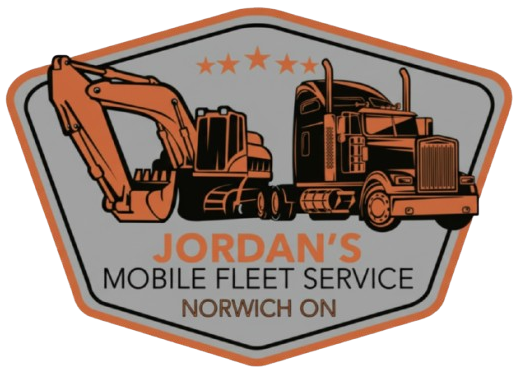

<!-- Project README: Jordan's Mobile Fleet Service -->

<p align="center">
	
</p>

# Jordan's Mobile Fleet Service 🚚🛠️

Clean, responsive Laravel site for Jordan's Mobile Fleet Service — updated styling, improved hero/video treatment, clearer CTAs, and a refined contact experience.

Quick status: UI updates applied (hero video overlay, navbar centering, contact form card, service pills styling, footer polish).

---

## Highlights

- 🎨 Theme: Preserves company orange accent with darker greys for contrast and accessibility.
- 🧭 Navigation: Logo flush-left with centered title and graceful truncation on small screens.
- 🎥 Hero: Video-backed hero sections with dark overlays for readable headings.
- 🧾 Services: Service items styled as non-clickable, bubbly `service-pill` elements (distinct from the primary CTA).
- ✉️ Contact: Contact form converted into a white card with clear labels and a prominent click-to-call phone link.

---

## Technologies

- PHP 8+ and Laravel
- Blade templates (resources/views)
- Vite for asset bundling (resources/css and resources/js)
- Modern CSS with responsive layout (resources/css/app.css)

---

## Local Development

Prerequisites:

- PHP (8.0+ recommended)
- Composer
- Node.js & npm

Setup and run locally:

```bash
composer install
cp .env.example .env
php artisan key:generate
npm install
npm run dev   # build frontend assets (watch mode)
php artisan serve --host=127.0.0.1 --port=8000
# then open http://127.0.0.1:8000
```

Notes:
- If you change environment variables, re-run `php artisan config:clear`.
- To build production assets use `npm run build`.

---

## Key Files (recently updated)

- Layout and global template: [resources/views/layouts/app.blade.php](resources/views/layouts/app.blade.php)
- Main stylesheet: [resources/css/app.css](resources/css/app.css)
- Homepage hero: [resources/views/home.blade.php](resources/views/home.blade.php)
- Services listing: [resources/views/sales.blade.php](resources/views/sales.blade.php)
- Contact page & form: [resources/views/contact.blade.php](resources/views/contact.blade.php)
- Company/About page: [resources/views/company.blade.php](resources/views/company.blade.php)

---

## What changed (summary)

- Updated `resources/css/app.css` with theme variables, `.narrow-wrapper`, `.service-pill` styling (now non-interactive), hero overlay and responsive navbar tweaks.
- Reworked `resources/views/layouts/app.blade.php` to include Google Fonts, a centered title, and a simplified footer with click-to-call link.
- Converted contact form into a white card (`.contact-form-card`) with labels above inputs and improved CTA copy.
- Services page (`sales.blade.php`) now renders service items as `<span class="service-pill">` so they look like pills but are not actionable buttons.

---

## Testing

Run tests (if present) with PHPUnit:

```bash
./vendor/bin/phpunit
```

Note: this project contains example tests under `tests/` but current UI edits are presentation-only.

---

## Contributing & Next Steps

- If you'd like further visual tweaks (font sizes, exact orange tint, pill interactions), open an issue or submit a PR.
- Suggested next steps:
	- Visual QA across desktop/tablet/mobile (run `npm run dev` + `php artisan serve`).
	- Fine-tune navbar title breakpoints and font sizes if the title truncates too aggressively.

---

## Contact

If you need help or want me to continue polishing the site (run builds, tweak colors, capture screenshots), reply here or reach out via the repository.

— Jordan's Mobile Fleet Service Dev Team
